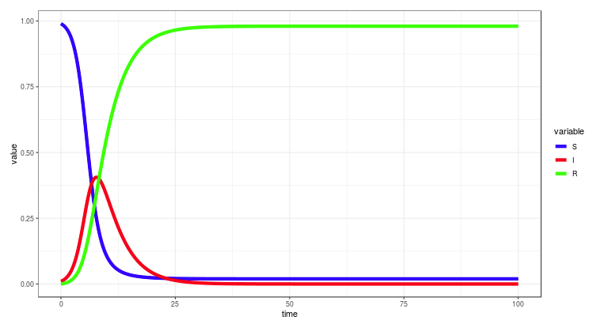

# SIR
Simulation of Kermack-McKendrick's SIR (Susceptible, Infected, Recovered) model. More information [here](https://en.wikipedia.org/wiki/Compartmental_models_in_epidemiology).

## How to run
- Run in `ShinyApps`: just click [here](https://pabrod.shinyapps.io/SIRmodel/)
- Run locally in `RStudio` (requires `Shiny`): type `runGitHub( "SIR", "PabRod")`

## Author
- [Pablo Rodríguez-Sánchez](https://pabrod.github.io) 

## References
- Mathematical biology, Murray, J.D., ISBN 978-0-387-22437-4
